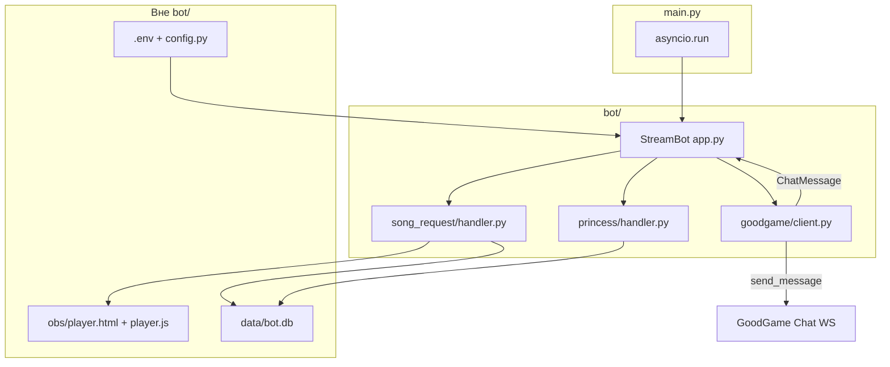
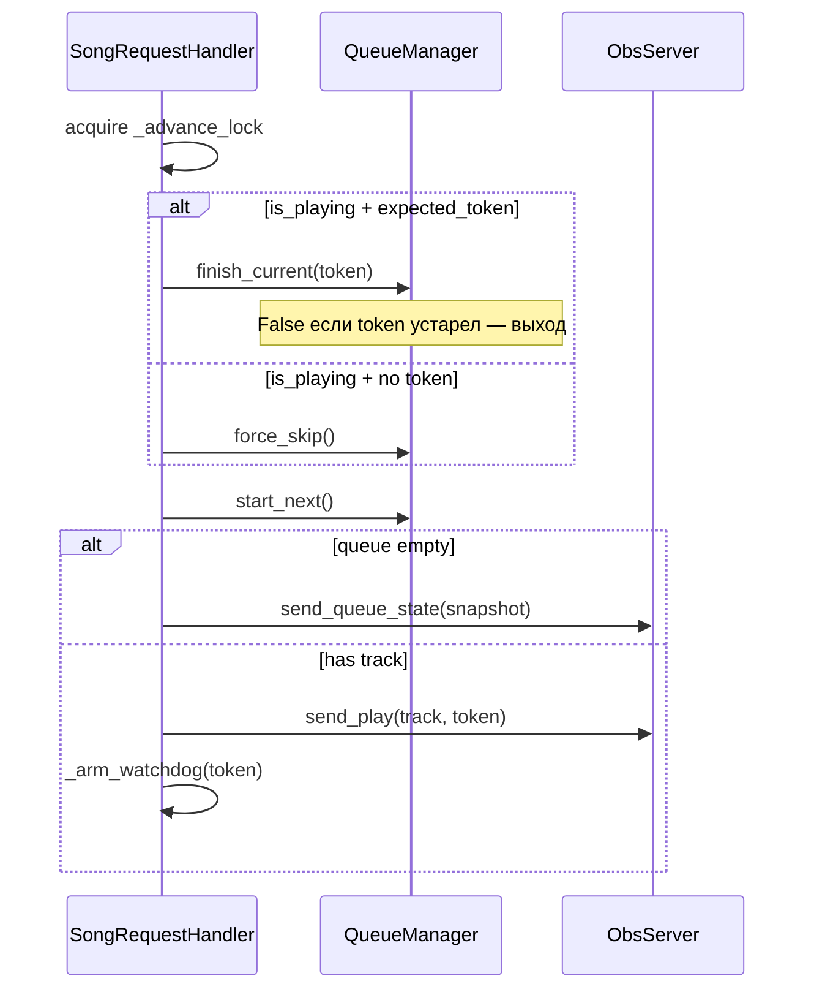
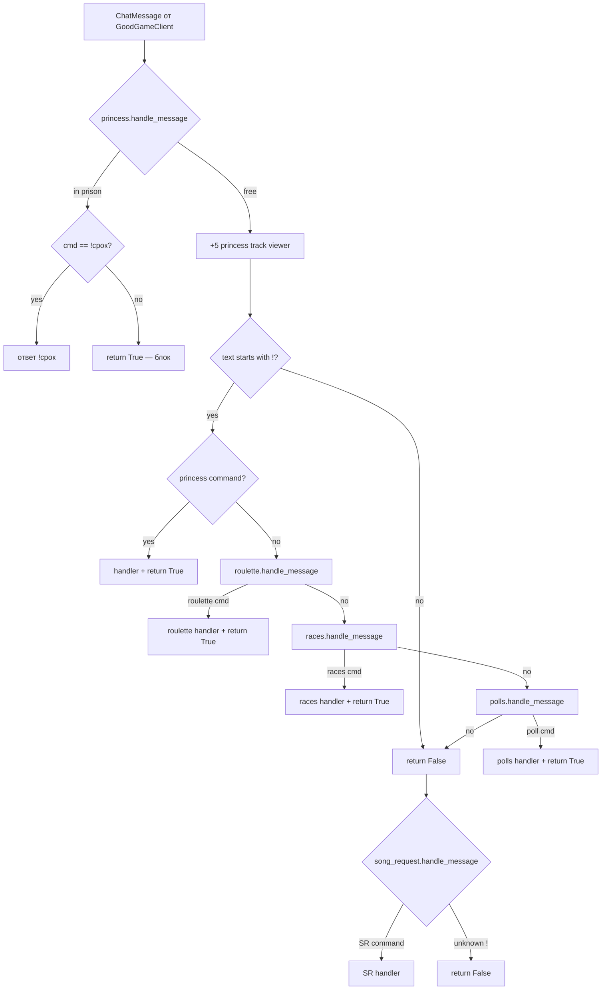

# README_DEV — документация для разработчиков

Подробное описание пакета `bot/` и связанных компонентов проекта **botmsc** — объединённого стрим-бота для GoodGame.ru: заказ музыки через YouTube/OBS и игровая экономика «принцесс».

Для пользовательской инструкции по запуску см. [README.md](README.md).

---

## Содержание

1. [Обзор архитектуры](#1-обзор-архитектуры)
2. [Структура каталогов](#2-структура-каталогов)
3. [Точка входа и конфигурация](#3-точка-входа-и-конфигурация)
4. [Оркестратор: `bot/app.py`](#4-оркестратор-botapppy)
5. [Модуль `bot/goodgame/`](#5-модуль-botgoodgame)
6. [Модуль `bot/song_request/`](#6-модуль-botsong_request)
7. [Модуль `bot/princess/`](#7-модуль-botprincess)
8. [Модуль `bot/roulette/`](#8-модуль-botroulette)
9. [Маршрутизация сообщений чата](#9-маршрутизация-сообщений-чата)
10. [Персистентность (`data/`)](#10-персистентность-data)
11. [Протокол OBS WebSocket](#11-протокол-obs-websocket)
12. [Логирование](#12-логирование)
13. [Тестирование](#13-тестирование)
14. [Расширение и TODO](#14-расширение-и-todo)
15. [Типичные проблемы](#15-типичные-проблемы)

---

## 1. Обзор архитектуры

Проект — **один asyncio-процесс**, один WebSocket к чату GoodGame, три игровых модуля + транспорт:

| Модуль | Назначение |
|--------|------------|
| `song_request` | Очередь YouTube-треков, локальный HTTP/WS для OBS Browser Source |
| `princess` | Игровая валюта «принцессы», кражи, daily, кубик и т.д. |
| `roulette` | Мини-игра `!рулетка`: раунды, общая казна, ставки за баллы |
| `races` | Мини-игра `!забег`: забеги принцесс, динамические коэффициенты |
| `polls` | Прогнозы `!опрос`: peer-pool ставки за баллы принцесс |
| `goodgame` | Общий транспорт: авторизация, reconnect, приём/отправка сообщений |



**Принципы:**

- Python — единственный источник правды о состоянии очереди воспроизведения (`QueueManager`).
- Каждый трек при старте получает уникальный `token` — защита от гонок (двойной `ended`, запоздавший `skip`).
- Princess и Song Request связаны через `StreamBot` и общий `bot/economy/` (`PointsStore`).
- OBS-плеер (`obs/`) не входит в `bot/`, маршруты — в `bot/web/routes/player.py`.

---

## 2. Структура каталогов

```
botmsc/
├── main.py                      # точка входа, logging, asyncio.run
├── config.py                    # dataclass Config из .env
├── smoke_test.py                # интеграционный тест song_request без GG
├── README_DEV.md                # этот файл
│
├── bot/
│   ├── __init__.py              # экспорт StreamBot
│   ├── app.py                   # StreamBot — оркестратор
│   ├── commands.py              # единый реестр публичных команд (!команды)
│   │
│   ├── web/                     # локальный HTTP-сервер
│   │   ├── server.py            # LocalWebServer
│   │   ├── static.py            # serve_obs_file()
│   │   ├── api.py               # JSON-хелперы для REST
│   │   └── routes/
│   │       ├── player.py        # OBS player + WebSocket /ws
│   │       ├── admin.py         # admin.html + /api/*
│   │       └── docs.py          # commands.html
│   │
│   ├── economy/                 # общая валюта
│   │   ├── points.py            # PointsStore
│   │   └── text.py              # pluralize_princess
│   │
│   ├── db/                      # SQLite persistence (aiosqlite)
│   │   ├── connection.py        # Database, WAL, transactions
│   │   ├── schema.py            # CREATE TABLE
│   │   ├── points.py
│   │   ├── steal.py
│   │   ├── daily.py
│   │   ├── queue.py
│   │   ├── prison.py
│   │   └── cooldowns.py
│   │
│   ├── goodgame/                # транспорт чата GG
│   │   ├── __init__.py
│   │   └── client.py            # GoodGameClient, ChatMessage
│   │
│   ├── song_request/            # YouTube + OBS
│   │   ├── __init__.py
│   │   ├── handler.py           # chat-команды заказа музыки
│   │   ├── playback.py          # advance, watchdog, refunds, WS status
│   │   ├── queue.py             # QueueManager, Track (async SQLite)
│   │   └── youtube.py           # validate_request, extract videoId
│   │
│   ├── princess/                # игровая экономика
│   │   ├── __init__.py
│   │   ├── handler.py           # роутер + passive income
│   │   ├── commands/            # реализации !баллы, !кража, !дайс и др.
│   │   ├── storage.py           # StealStore, DailyStore, DiceCooldownStore
│   │   ├── economy.py           # математика шансов, бонусов, MSK-время
│   │   └── prison.py            # PrisonManager (SQLite)
│   │
│   └── roulette/                # мини-игра !рулетка
│       ├── handler.py           # команды чата + admin API surface
│       ├── round.py             # IDLE → OPEN → SPIN → COOLDOWN
│       ├── bets.py              # парсинг ставок
│       ├── bank.py              # выплаты и банкротство казны
│       └── wheel.py             # колесо 0–36
│
├── scripts/
│   └── migrate_json_to_sqlite.py  # одноразовая миграция JSON → bot.db
│
├── obs/                         # фронтенд для OBS Browser Source и docs
│   ├── player.html
│   ├── player.js
│   ├── admin.html
│   ├── commands.html
│   └── mermaid.min.js
│
├── data/                        # runtime data (.gitignore)
│   ├── bot.db                   # единая SQLite БД
│   └── *.json.bak               # архив после миграции
│
└── logs/                        # bot.log + ротация (.gitignore)
```

---

## 3. Точка входа и конфигурация

### `main.py`

1. Настраивает `logging`: консоль + `logs/bot.log` (RotatingFileHandler, ~5 МБ × 5).
2. Загружает `Config.load()`.
3. Создаёт `StreamBot(cfg)` и вызывает `await bot.run()`.
4. При завершении (Ctrl+C) — `await bot.close()`.

### `config.py`

Dataclass `Config` читает переменные из `.env` (через `python-dotenv`).

| Переменная | Поле `Config` | Описание |
|------------|---------------|----------|
| `GG_LOGIN` | `gg_login` | Логин бота на GoodGame |
| `GG_PASSWORD` | `gg_password` | Пароль |
| `GG_USER_ID` | `gg_user_id` | ID бота (игнор своих сообщений). Можно пустым — подставится из chatlogin |
| `GG_CHANNEL_ID` | `gg_channel_id` | Числовой ID канала |
| `GG_CHANNEL_KEY` | `gg_channel_key` | Slug канала (только для логов) |
| `GG_ADMIN_USER_ID` | `gg_admin_user_id` | ID админа для `!списать` / `!начислить` |
| `OBS_WS_HOST` | `obs_host` | Хост локального сервера (default `127.0.0.1`) |
| `OBS_WS_PORT` | `obs_port` | Порт (default `8765`) |
| `MAX_QUEUE_SIZE` | `max_queue_size` | Лимит очереди (default `50`) |
| `MAX_DURATION_SEC` | `max_duration_sec` | Макс. длина трека, сек (default `300`) |
| `TRACK_WATCHDOG_EXTRA_SEC` | `track_watchdog_extra_sec` | Запас watchdog поверх max duration (default `60`) |
| `USER_COOLDOWN_SEC` | `user_cooldown_sec` | Кулдаун между `!sr` от одного user (0 = выкл.) |
| `YOUTUBE_API_KEY` | `youtube_api_key` | Заготовка под Data API (пока не используется) |
| `ALBUM_LINK_SECRET` | `album_link_secret` | Секрет подписи `k` и шифрования `api` в ссылке `!альбом` |
| `SITE_BASE_URL` | `site_base_url` | Базовый URL GitHub Pages (default `https://klon008.github.io/princtascdwk`) |
| `CLO_EXE_PATH` | `clo_exe_path` | Путь к `clo.exe` (default `tools/clo/clo.exe`) |
| `CLO_TOKEN` | `clo_token` | Токен CloudPub; перед publish бот делает `clo set token` |
| `CLO_PUBLIC_URL` | `clo_public_url` | Fallback URL туннеля (тесты без clo); иначе парсится из stdout clo |

**Album API** слушает `127.0.0.1:18770` (константа, не в `.env`). OBS-админка остаётся на `OBS_WS_PORT` (8765).

Подробнее: [TODO_album.md](./TODO_album.md).

**Админка карт:** `cards-admin.html` (кнопка «Карты» в `admin.html`) — настройки/`enabled`, серии, бустеры, тиражи и шансы, promo JPG, лимит открытий/день.

## 4. Оркестратор: `bot/app.py`

### Класс `StreamBot`

Собирает три подсистемы и маршрутизирует чат.

```python
class StreamBot:
    db: Database
    sr: SongRequestHandler
    princess: PrincessHandler
    roulette: RouletteHandler
    races: RacesHandler
    gg: GoodGameClient
```

#### Жизненный цикл

| Метод | Действие |
|-------|----------|
| `run()` | `db.open()` → `sr.start()` → `web.start()` → `princess.start()` → `roulette.start()` → `races.start()` → bind reply/points → `gg.run()` |
| `close()` | `princess.close()` → `roulette.close()` → `races.close()` → `sr.close()` → `web.stop()` → `gg.close()` → `db.close()` |

HTTP-маршруты регистрируются в `__init__`: `PlayerRoutes` (внутри `SongRequestHandler`), `AdminRoutes`, `DocsRoutes` на общем `LocalWebServer`.

Публичные поля: `bot.sr`, `bot.princess`, `bot.roulette`, `bot.races`, `bot.web`, `bot.admin`, `bot.gg`.

Роутинг чата: `princess → roulette → races → song_request`.

#### Ответы в чат

- **Song Request:** `_reply(text)` → `gg.send_message(text)` как есть (формат `@nick, ...`).
- **Princess:** `_princess_reply(user_name, text)` → `gg.send_message(f"{user_name}, {text}")`.
- **Races live:** `bind_remove(self._remove_chat)` → `gg.remove_message`; комментарий забега зовёт `_chat_live` (удалить предыдущий id → отправить новое).

Список команд для `!команды` — `bot/commands.py` (`PUBLIC_COMMANDS`, `format_help()`).

---

## 5. Модуль `bot/goodgame/`

### `client.py`

#### `ChatMessage`

Dataclass входящего сообщения:

| Поле | Тип | Описание |
|------|-----|----------|
| `channel_id` | `str` | ID канала |
| `user_id` | `str` | ID отправителя |
| `user_name` | `str` | Ник |
| `user_rights` | `int` | Уровень прав GG (≥10 = модератор стрима) |
| `text` | `str` | Текст сообщения |

Свойство `is_moderator`: `user_rights >= 10` (`RIGHTS_STREAM_MODER`).

#### `GoodGameClient`

**Авторизация:** POST `https://goodgame.ru/ajax/chatlogin` → `user_id` + `token`.

**WebSocket:** `wss://chat-1.goodgame.ru/chat2/`

Последовательность при подключении:
1. `{type: "auth", data: {user_id, token}}` (если есть токен)
2. `{type: "join", data: {channel_id, hidden: 0}}`

**Reconnect:** exponential backoff 1→2→4→…→30 сек; перед каждым переподключением —
повторный `chatlogin` (до 3 попыток). Старый `token` при ошибке HTTP не затирается.
После `auth` ждём `success_auth` (таймаут ~8с); иначе join в readonly и красный WARN в CLI.
`send_message` без auth не шлёт (ERROR в лог), чтобы не казалось, что «бот молчит без причины».

**Фильтрация:** собственные сообщения бота (`msg.user_id == self.user_id`) не передаются в `on_message` — иначе петля ответов. Echo своих сообщений используется для возврата `message_id` из `send_message`.

**Методы чата:**
- `send_message(text) -> Optional[str]` — отправка; возвращает `message_id` из echo (таймаут 5с → `None`).
- `remove_message(message_id)` — удаление сообщения (`type: remove_message`). Нужны права **stream_moder+** (помощник стримера) на канале.

Входящие чужие сообщения обрабатываются через `asyncio.create_task`, чтобы ожидание echo в `send_message` не блокировало WS-reader.

**Гостевой режим:** без `GG_LOGIN`/`GG_PASSWORD` бот подключается без auth (readonly, `send_message` молча пропускается).

Документация протокола: [GoodGame Chat protocol v2](https://github.com/GoodGame/API/blob/master/Chat/protocol2.md).

---

## 6. Модуль `bot/song_request/`

### 6.1. `handler.py` — `SongRequestHandler`

Главный класс модуля. Владеет очередью, `PlayerRoutes`, `PlaybackController` и обрабатывает SR-команды.

#### Публичный API

| Метод / поле | Описание |
|-------|----------|
| `start()` | Загрузка очереди из SQLite |
| `close()` | Остановка playback + закрытие WS-клиентов |
| `bind_reply(fn)` | `fn(text: str) -> Awaitable[None]` |
| `bind_points(store)` | `PointsStore` из `bot/economy/` |
| `handle_message(msg)` | Обработка команды; `True` если команда SR |
| `advance(expected_token, skip_reason?)` | Продвижение очереди |
| `playback` | `PlaybackController` — watchdog, refunds, OBS status |
| `player` | `PlayerRoutes` — HTTP/WS для OBS Browser Source |

#### Команды чата

| Команда | Кто | Поведение |
|---------|-----|-----------|
| `!sr <url>` | все | Валидация YouTube → добавление в очередь → автостарт если idle |
| `!skip` | модератор (`user_rights >= 10`) | WS `skip` плееру; если плеер offline — force skip |
| `!queue`, `!q` | все | Показать длину очереди и до 3 следующих videoId |
| `!song`, `!now` | все | Текущий трек (кто заказал + url/title) |

Проверка команд — **exact match** по первому слову (`text.split()[0].lower()`).

#### Алгоритм `advance()`



#### Watchdog

Если трек не завершился за `MAX_DURATION_SEC + TRACK_WATCHDOG_EXTRA_SEC`, вызывается `advance(token, "таймаут воспроизведения")`.

Страховка от зависших live-стримов и потерянных WS-событий.

---

### 6.2. `queue.py` — `QueueManager`

In-memory очередь с **async** персистентностью в SQLite (`queue_meta` + `queue_items` в `data/bot.db`).

#### `Track`

```python
@dataclass
class Track:
    video_id: str
    requested_by: str          # user_id заказчика
    url: str
    title: str = ""
    requested_by_name: str = ""  # ник для оверлея OBS
    added_at: float              # unix timestamp
```

#### Состояние

- `_queue: list[Track]` — ожидающие треки
- `current: Track | None` — играющий сейчас
- `current_token: str | None` — токен текущего воспроизведения (`t-1`, `t-2`, …)

#### Персистентность

- `await load()` — при `SongRequestHandler.start()`.
- Каждая мутация — `await _save()` в одной SQL-транзакции.
- При загрузке: если был `current` на момент падения — возвращается **в голову** `_queue` (не теряется при рестарте).

#### Ключевые методы

| Метод | Описание |
|-------|----------|
| `await add(track)` | Добавить в хвост; return позиция (1-based) |
| `await start_next()` | Pop head → `current` + новый token |
| `await finish_current(token)` | Завершить только если token совпал |
| `await force_skip()` | Сбросить current без проверки token |
| `snapshot()` | `{playing, current, queueLength}` для OBS |

---

### 6.3. `web/routes/player.py` — `PlayerRoutes`

Маршруты OBS-плеера на общем порту (`OBS_WS_HOST:OBS_WS_PORT`), регистрируются через `register(app)`.

#### HTTP-маршруты

| URL | Файл |
|-----|------|
| `/`, `/player.html` | `obs/player.html` |
| `/player.js` | `obs/player.js` |
| `/booster.html` | `obs/booster.html` — анимация открытия бустера (~384×560) |
| `/booster.js` | `obs/booster.js` |
| `/fishing-record.html` | `obs/fishing-record.html` — плашка недельного рекорда рыбалки (~1200×450) |
| `/fishing-record.js` | `obs/fishing-record.js` |
| `/commands.html` | `obs/commands.html` (через `DocsRoutes`) |
| `/admin.html` | `obs/admin.html` (через `AdminRoutes`) |
| `/cards-admin.html` | `obs/cards-admin.html` — админка карт (серии, бустеры, тиражи) |
| `/roulette.html` | `obs/roulette.html` — SVG-колесо рулетки для стрима |
| `/roulette.js` | `obs/roulette.js` |
| `/races.html` | `obs/races.html` — забег принцесс для стрима |
| `/races.js` | `obs/races.js` |
| `/assets/princesses/*.webp` | Иконки принцесс для OBS-оверлея скачек (128×128) |

Статика берётся из `obs/` через `bot/web/static.py`. **Важно:** Browser Source в OBS должен открывать `http://127.0.0.1:PORT/player.html`, не `file://` — иначе YouTube Error 153 (referrer).

#### WebSocket `/ws`

- Поддерживает несколько клиентов (broadcast всем).
- Heartbeat 30 сек.
- Входящие JSON → `PlaybackController.on_obs_status()`.

#### Исходящие команды (Python → плеер)

```json
{"action": "play", "videoId": "...", "token": "t-1", "maxDurationSec": 300, "requestedBy": "nick", "title": ""}
{"action": "skip", "token": "t-1"}
{"action": "toggle_pause", "token": "t-1"}
{"action": "queue_state", "playing": false, "queueLength": 0, "current": null}
{"action": "booster_open", "openingId": "…", "userName": "nick", "cards": [{"id":"elsa","name":"…","rarity":"mythic","isDuplicate":false,"refund":0,"imageUrl":"/assets/cards/elsa.webp","cardBackUrl":"/assets/cards/card-back.svg"}]}
```

`booster_open` обрабатывает только `booster.html` (плеер игнорирует). Ответ overlay: `{status:"ready", overlay:"booster"}` и `{status:"booster_done", openingId}`.

Недельный рекорд рыбалки (`!рыбалка` → `week_species_record`):

```json
{"action": "fishing_record", "userName": "Nick", "species": "Щука", "weight": 3.42, "imageUrl": "/assets/fishing/shuka.png"}
```

Обрабатывает только `fishing-record.html`. Готовность: `{status:"ready", overlay:"fishing_record"}`.
Арты: `obs/assets/fishing/{slug}.png`, маппинг вида→slug в `bot/fishing/record_assets.py` (не в settings.py).
Превью в браузере: `?preview=1` или `?preview=shuka`.
---

### 6.4. `youtube.py`

Синхронная валидация аргумента `!sr` **без YouTube Data API**.

#### Поддерживаемые форматы URL

- `youtube.com/watch?v=ID`
- `youtu.be/ID`
- `/shorts/ID`, `/embed/ID`, `/live/ID`, `/v/ID`
- Хосты: youtube.com, m.youtube.com, music.youtube.com, youtu.be

Из текста берётся **первое слово**, содержащее `youtu`. Если нет `http://` — добавляется `https://`.

#### API

```python
validate_request(raw: str) -> ValidationResult  # ok, video_id, reason
canonical_url(video_id: str) -> str             # https://www.youtube.com/watch?v=...
```

Проверки длительности, live, embeddable, 18+ — **на стороне плеера** (`obs/player.js`, события `too_long` / `error`).

---

## 7. Модуль `bot/princess/`

### 7.1. `handler.py` — `PrincessHandler`

Игровая экономика для зрителей чата.

#### Публичный API

| Метод | Описание |
|-------|----------|
| `start()` | Загрузка JSON stores + запуск `_passive_income_loop` |
| `close()` | Cancel tick задачи пассивного дохода |
| `bind_reply(fn)` | `fn(user_name, text) -> Awaitable[None]` |
| `handle_message(msg)` | `True` = princess обработал (SR не вызывается) |

#### Пассивный доход

На **каждое** сообщение (кроме тюрьмы):
- регистрация в `_viewers`
- **+5 принцесс**

Фоновая задача каждые 60 сек:
- **+3 принцессы** каждому зрителю из `_viewers` (если не в тюрьме)

`_viewers` — in-memory dict `{user_id: {user_name, last_active}}`. Legacy `user_left` из старого бота не используется.

#### Тюрьма (интеграция с `prison.py`)

Если пользователь в тюрьме:
- обрабатывается **только** `!срок`
- все остальные команды (включая `!sr`) **молча блокируются** (`return True`)
- пассивный доход (+5 за сообщение) **не начисляется**

#### Команды

| Команда | Описание |
|---------|----------|
| `!баллы` | Баланс принцесс |
| `!кража` | Попытка кражи (среда/пятница, ≥5 viewers, кулдаун 10 мин) |
| `!карман` | Статистика краж |
| `!дейлик` | Ежедневный бонус (exact `!дейлик`, без аргументов) |
| `!дайс` | Кубик d20 за 5 принцесс (кулдаун 5 мин) |
| `!дисней` | Случайная принцесса Disney |
| `!нейро` | Ссылка на Shedevrum |
| `!звук` | Список звуковых команд стримера |
| `!коллекция` | Ссылка на YouTube-коллекцию |
| `!срок` | Остаток тюрьмы / «не в тюрьме» |
| `!списать nick N` | Админ: списать N у nick |
| `!начислить nick N` | Админ: начислить N nick |

Админ: `msg.user_id == GG_ADMIN_USER_ID`. Если `GG_ADMIN_USER_ID` пуст — админ-команды недоступны никому.

#### Логика `!кража` (кратко)

1. День недели: среда или пятница (MSK, `economy.is_steal_allowed()`).
2. Минимум 5 зрителей в `_viewers`.
3. Кулдаун 10 мин на пользователя.
4. Бросок `1..100` против `chance` (растёт с попытками/успехами, см. `economy.update_chance`).
5. При успехе — случайная жертва из `_viewers` (не себя).
6. Жертва должна иметь ≥18000 принцесс; украсть можно до `min(2500, balance - 18000)`.
7. **Тюрьма после пресечённой кражи:** даже если жертва «слишком бедная», `stolen` от `calculate_princess_amount` участвует в проверке шанса тюрьмы (`prison_chance_for_amount`) — by design.

---

### 7.2. `storage.py`

Тонкие async-обёртки над `bot/db/*` для princess-игровых данных.

| Класс | Таблицы SQLite | Описание |
|-------|----------------|----------|
| `StealStore` | `steal_stats` | Статистика краж; `execute_steal()` через pending `PointsStore` |
| `DailyStore` | `daily_meta`, `daily_progress`, `daily_claims` | `mutate()` эмулирует dict для handler |
| `DiceCooldownStore` | `dice_cooldowns` | Кулдаун `!дайс` |

Балансы — в `bot/economy/points.py` (`PointsStore`).

---

### 7.3. `economy.py` (princess)

Чистые функции игровой математики (без I/O).

| Функция | Описание |
|---------|----------|
| `now_msk()` | Текущее время в `Europe/Moscow` (`zoneinfo`, нужен пакет `tzdata` на Windows) |
| `update_chance(info)` | Пересчёт `%` кражи по attempts/success |
| `calculate_princess_amount(chance)` | Сумма «попытки» для тюрьмы (не всегда реально украденная) |
| `get_daily_bonus(day_number)` | Бонус N-го использования `!дейлик` в месяце |
| `is_steal_allowed()` | `weekday in (2, 4)` — среда, пятница |
| `prison_chance_for_amount(stolen)` | 7% / 12% / 25% при stolen 500–999 / 1000–1999 / 2000–2500 |

---

### 7.4. `prison.py` — `PrisonManager`

Персистентность в таблице `prison` (`user_id`, `release_time`). Переживает рестарт бота.

| Константа | Значение |
|-----------|----------|
| `PRISON_DURATION_SEC` | 1800 (30 мин) |

| Метод | Описание |
|-------|----------|
| `await is_in_prison(user_id)` | Проверка + авто-очистка истёкших |
| `await imprison(user_id)` | Посадить на 30 мин |
| `await format_srok(user_id)` | «осталось N мин · выход в HH:MM (МСК)» |

---

### 7.5. `bot/db/connection.py` — `Database`

- Один файл: `data/bot.db`, драйвер `aiosqlite`.
- При `open()`: `PRAGMA journal_mode=WAL`, `foreign_keys=ON`, `busy_timeout=5000`.
- `transaction()` — context manager для атомарных операций (кража, очередь).
- `StreamBot` открывает БД в `run()`, закрывает в `close()`.

---

## 8. Модуль `bot/roulette/`

Мини-игра `!рулетка`: общий раунд на весь чат, ставки списываются с `PointsStore`, выигрыши платятся из общей казны `minigames_bank`.

### Состояния раунда

`IDLE → OPEN → SPIN_WAIT → SPIN → COOLDOWN → IDLE`

- **Авто-режим** (`auto_enabled`): первая ставка открывает стол, спин по таймеру сбора.
- **Ручной режим**: открытие и спин через вкладку «Рулетка» в `admin.html`.
- **OBS-оверлей**: `obs/roulette.html` + `roulette.js` — SVG-колесо, опрос `GET /api/roulette`; вращение в `SPIN_WAIT`, остановка на `last_result`. URL: `http://127.0.0.1:PORT/roulette.html` (Browser Source, прозрачный фон). Отладка: `?debug=1`, превью колеса: `?visible=1` (с `?debug=1` — пример баннера результата).

### Команды

| Команда | Кто | Описание |
|---------|-----|----------|
| `!рулетка <сумма> ...` | все | Ставка (число, цвет, чётность, малые/большие) |
| `!рулетка правила` | все | Краткая справка |
| `!рулетка_банк` | админ | Баланс общей казны мини-игр |
| `!рулетка_пополнить N` | админ | Пополнить казну |
| `!рулетка_сброс` | админ | Сброс казны до `BANK_RESET_AMOUNT` |

### Admin API

| Метод | Путь |
|-------|------|
| GET/PUT | `/api/roulette` |
| POST | `/api/roulette/open`, `/spin`, `/bank`, `/cancel` |

### Настройки

`bot/roulette/settings.py` (из `settings.example.py`): лимиты ставок, таймеры сбора и cooldown. Лимиты казны — `bot/minigames/settings.py`.

### SQLite

| Таблица | Содержимое |
|---------|------------|
| `minigames_bank` | Общая казна рулетки и скачек |
| `roulette_meta` | Режим, состояние, таймеры, последний спин |
| `roulette_bets` | Ставки текущего раунда (`UNIQUE(round_id, user_id)`) |

---

## 8.1. Модуль `bot/races/`

Мини-игра `!забег`: 10 случайных принцесс из `bot/princesses.py`, динамические коэффициенты, симуляция забега, общая казна `minigames_bank`.

### Состояния раунда

`IDLE → OPEN → RACE_WAIT → RACE → COOLDOWN → IDLE`

- **Авто-режим**: `!забег` открывает забег и показывает состав; ставка — `!забег <сумма> <1–6>` только когда забег `OPEN`.
- **OBS-оверлей**: `obs/races.html` + `races.js` — на весь browser source (~200px высоты). Состав и номера на иконках во время ставок (poll `/api/races`); гонка — плавная RAF-анимация по WS-сценарию (`action: race_start`). Статусы `boost`/`slow`/`stun` — цвет обводки. Один слот WS (`overlay: races`); дубль вытесняется. URL: `http://127.0.0.1:PORT/races.html`. Отладка: `?debug=1`, превью: `?visible=1`.
- **Логика забега**: бэк один раз считает `simulate_race` + `build_obs_script`, шлёт сценарий в OBS, ждёт `race_done` (или таймаут), затем выплаты и чат. Победителя с фронта не принимает.
- **Чат**: старт («Старт! Погнали!»), ставки, итоговый финиш с подиумом и выплатами. Live-сводок во время гонки нет.

### Команды

| Команда | Кто | Описание |
|---------|-----|----------|
| `!забег` | все | Открыть забег и показать состав (без списания баллов) |
| `!забег <сумма> <1–6>` | все | Ставка на «лошадь» в текущем составе |
| `!забег правила` | все | Краткая справка |
| `!забег кэфы` | все | Коэффициенты текущего состава (одна строка) |
| `!забег_банк` | админ | Баланс общей казны |
| `!забег_пополнить N` | админ | Пополнить казну |
| `!забег_сброс` | админ | Сброс казны до `BANK_RESET_AMOUNT` |

### Admin API

| Метод | Путь |
|-------|------|
| GET/PUT | `/api/races` |
| POST | `/api/races/open`, `/start`, `/bank`, `/cancel` |

`GET /api/races` также отдаёт `princess_stats[]` — полный справочник принцесс с `races_count`, `wins_count`, `win_rate` (для read-only таблицы в админке).

### SQLite

| Таблица | Содержимое |
|---------|------------|
| `races_meta` | Режим, состояние, таймеры, прогресс забега, последний результат |
| `races_bets` | Ставки раунда |
| `races_lineup` | Состав (№, принцесса) |
| `races_princess_stats` | История участий и побед для odds |

## 8b. Опросы (predictions)

Peer-pool прогноз за баллы принцесс (не использует `minigames_bank`): `IDLE → OPEN → LOCKED → RESOLVED`.

| Команда | Описание |
|---------|----------|
| `!опрос` | Статус / банк / коэффициенты |
| `!опрос <сумма> <номер>` | Ставка (мин. 10), можно докинуть на тот же вариант |
| `!опрос правила` | Справка |

| Метод | Путь |
|-------|------|
| GET | `/api/poll` |
| POST | `/api/poll/create`, `/lock`, `/resolve`, `/cancel` |

OBS: `/prediction.html`. Админка: вкладка «Опросы».

| Таблица | Содержимое |
|---------|------------|
| `poll_meta` | Состояние, вопрос, варианты JSON, таймер, last_result |
| `poll_bets` | Ставки раунда (`UNIQUE(round_id, user_id)`) |

## 9. Маршрутизация сообщений чата



**Приоритет:** princess → cards → roulette → races → polls → song_request. Если модуль вернул `True`, следующие не вызываются.

**Формат ответов:**

| Модуль | Пример |
|--------|--------|
| song_request | `@nick, добавлено в очередь (#1)` |
| princess | `nick, У тебя: 42 принцессы` |

---

## 10. Персистентность (`data/`)

Подробности миграции, схема таблиц, WAL и эксплуатация — в **[README_SQL.md](README_SQL.md)**.

Единый файл **`data/bot.db`** (SQLite + WAL). JSON больше не пишется.

| Таблица | Модуль | Содержимое |
|---------|--------|------------|
| `points` | princess | Балансы |
| `steal_stats` | princess | Статистика краж |
| `daily_meta`, `daily_progress`, `daily_claims` | princess | `!дейлик` |
| `prison` | princess | Тюрьма |
| `dice_cooldowns` | princess | Кулдаун кубика |
| `queue_meta`, `queue_items` | song_request | Очередь и текущий трек |
| `minigames_bank` | roulette, races | Общая казна мини-игр |
| `roulette_meta`, `roulette_bets` | roulette | Состояние и ставки раунда |
| `races_meta`, `races_bets`, `races_lineup`, `races_princess_stats` | races | Забеги, состав, статистика |

Каталог `data/` в `.gitignore`.

### Миграция с JSON

Если есть старые `*.json`, выполните **один раз**:

```powershell
python scripts/migrate_json_to_sqlite.py
```

Скрипт: бэкап `data/backup-YYYYMMDD/`, импорт, сверка сумм, переименование JSON → `*.json.bak`.

**Не открывайте `bot.db` в GUI-редакторе во время работы бота** — риск `database is locked` на Windows.

---

## 11. Протокол OBS WebSocket

Реализация плеера: `obs/player.js` (вне `bot/`, но контракт описан здесь).

### Плеер → Python

| status | Поля | Когда |
|--------|------|-------|
| `ready` | `overlay?` (`booster`) | WS подключён; бустер-overlay шлёт `overlay:"booster"` |
| `ended` | `token`, `videoId` | Видео доиграло |
| `error` | `token`, `videoId`, `code` | YouTube onError |
| `too_long` | `token`, `videoId`, `durationSec` | duration > maxDurationSec или live |
| `booster_done` | `openingId` | Анимация открытия бустера завершена |

### Python → плеер

См. [6.3](#63-webroutesplayerpy--playerroutes).

### Поведение idle

- Плеер **скрыт** (opacity/visibility), iframe lazy-init при первом `play`.
- После `ended` / `skip` / пустой очереди — `clearVideo()` + hide animation.
- Оверлей «кто заказал — название» (`#nowPlaying`) виден только при воспроизведении.

---

## 12. Логирование

| Logger | Модуль |
|--------|--------|
| `app` | StreamBot |
| `goodgame` | GoodGameClient |
| `song_request` | SongRequestHandler |
| `song_request.queue` | QueueManager |
| `song_request.obs` | PlayerRoutes (WebSocket /ws) |
| `web` | LocalWebServer |
| `admin` | AdminRoutes REST API |
| `princess` | PrincessHandler |
| `princess.storage` | StealStore, DailyStore, DiceCooldownStore |
| `roulette` | RouletteHandler, RoundManager |
| `bot.db` | Database, schema, SQL CRUD |

`aiohttp.access` приглушён до WARNING в `main.py`.

---

## 13. Тестирование

### `smoke_test.py`

Интеграционный тест **без GoodGame**:

1. Поднимает `StreamBot` с `LocalWebServer` (player + admin API).
2. Проверяет HTTP `player.html` / `player.js`, `admin.html`.
3. Эмулирует WS-клиент: `ready` → 2 трека → `ended` → проверка token-guard → пустая очередь.
4. Проверяет API и логику рулетки: парсинг ставок, раунд, дубликат, банкротство казны.

Запуск:

```powershell
.\.venv\Scripts\python.exe smoke_test.py
```

Требует свободный порт `OBS_WS_PORT` (default 8765).

### Ручная проверка princess

Отдельного автотеста нет. Команды проверяются в живом чате GG.

---

## 14. Расширение и TODO

### Добавить SR-команду

1. Метод `_cmd_*` в `song_request/handler.py`.
2. Ветка в `handle_message()` по `cmd`.
3. При необходимости — расширить `QueueManager` или протокол OBS.

### Добавить princess-команду

1. Функция `cmd_*` в `princess/commands/*.py`.
2. Запись в dict `handlers` в `princess/handler.py`.
3. При необходимости — добавить алиас в `bot/commands.py` (`PUBLIC_COMMANDS`).

### YouTube Data API (заготовка)

- Ключ: `YOUTUBE_API_KEY` в `.env`.
- Точка расширения: `song_request/youtube.py` — pre-check до `queue.add()`.
- Сейчас проверки embeddable/длины делает плеер post-factum.

### SQLite

Реализовано в `bot/db/` + обёртки в `princess/storage.py` и `song_request/queue.py`. Зависимость: `aiosqlite`.

### Отключить модуль

В `StreamBot.run()` можно не вызывать `princess.start()` или `sr.start()` — модули независимы. Для production обычно нужны оба.

---

## 15. Типичные проблемы

| Симптом | Причина | Решение |
|---------|---------|---------|
| YouTube Error 153 в OBS | Browser Source открыт как `file://` | URL `http://127.0.0.1:PORT/player.html` |
| Бот не отвечает в чат | Нет `GG_LOGIN`/`GG_PASSWORD` | Заполнить `.env`, перезапустить |
| Бот отвечает сам себе | `GG_USER_ID` не совпадает | Указать ID из chatlogin |
| Порт 8765 занят | Предыдущий процесс не завершён | Закрыть старый `python main.py` |
| Очередь «залипла» после краша | Незавершённый `current` | При рестарте вернётся в queue; или очистить `queue_items` в `bot.db` |
| `database is locked` | `bot.db` открыт в DB Browser / второй процесс | Закрыть редактор, оставить один `python main.py` |
| Princess данные повреждены | Ручное редактирование БД | Восстановить из `data/backup-*` или `*.json.bak` |
| `!sr` не работает в тюрьме | By design | Только `!срок` в prison |
| `ZoneInfoNotFoundError` | Нет tzdata на Windows | `pip install tzdata` |

---

## Быстрая шпаргалка импортов

```python
from bot import StreamBot
from bot.commands import PUBLIC_COMMANDS, format_help
from bot.economy import PointsStore, pluralize_princess
from bot.goodgame import ChatMessage, GoodGameClient
from bot.song_request import SongRequestHandler, QueueManager, Track
from bot.princess import PrincessHandler
from config import Config
```

---

*Документ актуален для структуры `bot/` после рефакторинга: `web/`, `economy/`, `goodgame/`, `song_request/`, `princess/`, оркестратор `app.py`.*
