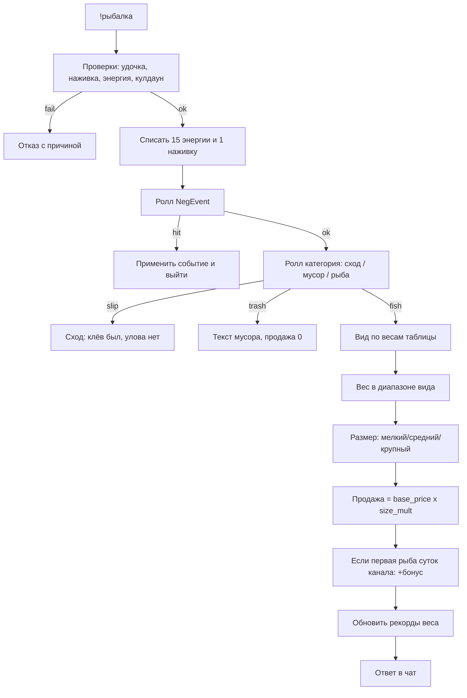

# Концептуальное ТЗ: модуль «Рыбалка»

**Принцессы** — внутренняя валюта чата бота (также «баллы»): не реальные деньги, а очки игровой экономики канала. Их получают за активность и мини-игры, тратят на механики бота. В рыбалке принцессы нужны для покупки опарышей и удочки, штрафов событий, наград («первая рыба дня», недельный топ) и приходят обратно через продажу улова.

---

## 1. Цель и границы

Быстрая чат-мини-игра: `!рыбалка` → мгновенный результат (улов / сход / мусор / событие) → при рыбе сразу продажа за принцессы.

**Есть:** ручной заброс; энергия; черви и опарыш; удочка; продажа; первая рыба дня; недельный топ по весу видов; ручная выдача наград недели + CLI-напоминание; негативные события; сходы; пулы атмосферных текстов; `!рыбалка помощь`.

**Нет (стадия 1):** сессии и авто-рыбалка; «подсеки»; водоёмы; редкость как ярлык; карточки/альбом; зависимость от online/viewers стрима.

---

## 2. Принципы UX

1. Один `!рыбалка` = одна проверка ресурсов + один ролл + один ответ в чат.
2. Ответ наглядный: вид, размер, вес, сумма продажи (или текст события).
3. Нет состояния «рыбачу / не рыбачу».
4. Время модуля своё (реген, сутки, неделя) — присутствие в GG не нужно.
5. Игрок управляет ресурсами и рисками, а не спамит ради авто-фарма.
6. Тексты берутся из пулов вариаций (случайно), чтобы ответы не звучали одинаково.
7. Каждый ответ на `!рыбалка` (успех, сход, мусор, событие) **самодостаточен**: в конце — строка ресурсов (§11.11).
8. Отказы содержат мини-подсказку, что делать дальше.

---

## 3. Ресурсы

### 3.1. Энергия

| Параметр | Значение |
|----------|----------|
| Максимум | 100 |
| Полный реген | ~1 час всегда (пассивно, без пауз) |
| Реген | +1 энергия каждые 36 секунд (100 за 3600 с) |
| Стоимость `!рыбалка` | 15 |
| Стоимость `!рыбалка черви` | 15 |
| Суточный ресет | → 100 |
| Админ-кнопка | → 100 всем рыбакам |

Без достаточной энергии действие отклоняется.

### 3.2. Наживка

Два типа, на заброс тратится **1 штука любого** типа.

| Тип | Как получить | Пакет |
|-----|--------------|--------|
| Черви | `!рыбалка черви` за энергию | −15 энергии → **+5 червей** |
| Опарыш | `!рыбалка опарыш` за принцессы | **−20 принцесс → +10 опарышей** |

**Приоритет списания на заброс:** сначала черви, если червей 0 — опарыш.

**Сутки:** оба типа → **0** (протухли). Удочка не сбрасывается.

Без любой наживки заброс невозможен.

### 3.3. Удочка

| Параметр | Значение |
|----------|----------|
| Старт | удочки нет — ловить нельзя |
| Покупка / починка | **1000 принцесс** → целая удочка |
| Состояния | целая / сломана |
| Сломана | `!рыбалка` запрещена, пока не купят новую |

### 3.4. Принцессы (связь с модулем)

**Стоки:** опарыш, удочка, русалка и аналоги.

**Источники:** продажа рыб, первая рыба дня, недельные награды (ручная выдача стримером).

---

## 4. Команды

Все действия — подкоманды `!рыбалка …` (кроме голого заброса).

| Команда | Действие |
|---------|----------|
| `!рыбалка` | Заброс (−15 энергии, −1 наживка) → результат |
| `!рыбалка черви` | −15 энергии → +5 червей |
| `!рыбалка опарыш` | −20 принцесс → +10 опарышей |
| `!рыбалка помощь` | Краткая справка для новичков |
| `!рыбалка удочка` | Купить/починить за 1000 принцесс |
| `!рыбалка улов` | Личные рекорды веса по видам + запас ресурсов |
| `!рыбалка топрыба` | Недельный лидерборд |
| `!рыбалка энергия` | Энергия, черви, опарыш, статус удочки |

Админ (отдельно от публичных подкоманд): восстановление энергии всем; **выдача наград закрытой недели** (см. §10.2, §11.16).

Антиспам заброса: **20 секунд** между успешными `!рыбалка`.

В публичный `!команды` достаточно вынести `!рыбалка` (подсказки — через `!рыбалка помощь`).

---

## 5. Заброс: алгоритм



---

## 6. Формулы

### 6.1. Продажа рыбы (вариант B)

```
продажа = base_price(вид) × size_mult(размер)
```

Размер по доле веса в диапазоне вида `[w_min, w_max]`:

```
t = (weight - w_min) / (w_max - w_min)
```

| t | Размер | size_mult |
|---|--------|-----------|
| t < 0.40 | мелкий | **0.5** |
| 0.40 ≤ t < 0.75 | средний | **1.0** |
| t ≥ 0.75 | крупный | **2.0** |

Вес в ответе: 2 знака после запятой (кг).

### 6.2. Ролл заброса (после списания ресурсов)

1. **Негативное событие** — таблица §9 (взаимоисключающие шансы, сумма 6%).
2. Иначе **категория** (взаимоисключающие): сход **20%**, мусор **18%**, рыба **62%**.
3. **Сход** — клёв был, рыба сорвалась; наживка уже списана, продажа 0 (не «первая рыба дня»).
4. Если рыба — выбор вида по весам §7; вес равномерно в `[w_min, w_max]`; размер и продажа по §6.1.
5. Если это первая **рыба** (не сход/мусор/событие) в текущих сутках канала — **+150 принцесс** поверх продажи («Первая рыба дня»), один раз на весь канал.

Итог начисления принцесс за успешную рыбу:

```
итог = продажа + (150 если первая_рыба_дня иначе 0)
```

---

## 7. Таблица видов рыб

Шансы ниже — **условные веса среди рыб** (после того как уже выпала «рыба», не от всего заброса).

| Вид | Вес дропа | w_min–w_max (кг) | base_price | Мелк / Сред / Круп |
|-----|-----------|------------------|------------|---------------------|
| Карась | 28 | 0.15–0.80 | 10 | 5 / 10 / 20 |
| Плотва | 22 | 0.10–0.55 | 12 | 6 / 12 / 24 |
| Окунь | 18 | 0.20–1.20 | 20 | 10 / 20 / 40 |
| Лещ | 12 | 0.40–2.00 | 30 | 15 / 30 / 60 |
| Щука | 10 | 0.80–4.00 | 45 | 22 / 45 / 90 |
| Сом | 6 | 1.50–8.00 | 70 | 35 / 70 / 140 |
| Осётр | 4 | 2.00–12.00 | 125 | 62 / 125 / 250 |

Сумма весов = 100. Дорогие виды реже; осётр — топ ценности.

---

## 8. Сход и мусор (продажа 0)

### 8.1. Сход

Обычный исход: была поклёвка, но рыба сорвалась. Энергия и наживка уже потрачены. Не путать с камышами (§9) — сход банальный и частый. Тексты — §11.7.

### 8.2. Мусор

Среди исхода «мусор» равновероятно один из шести типов. Продажа = 0. Полные тексты — §11.8.

Типы: водоросли, старый ботинок, ржавая банка, коряга, дырявое ведро, чужой поплавок.

---

## 9. Негативные события

Ролл **до** схода/мусора/рыбы. События взаимоисключающие. Полные тексты — §11.6.

| Событие | Шанс | Эффект |
|---------|------|--------|
| Русалка | 1% | −3000 принцесс (не ниже 0) |
| Щука под корягу | 1.5% | удочка → сломана |
| Чайка | 1.5% | −min(3, запас) наживки суммарно (сначала черви, потом опарыш) |
| Ил | 1% | −10 энергии (не ниже 0) |
| Камыши | 1% | пустой исход, без рыбы (ресурсы заброса уже списаны) |

Сумма негатива: **6%** забросов.

При поломке удочки — в том же ответе указать `!рыбалка удочка` (1000 принцесс) + строка ресурсов со статусом «сломана».

---

## 10. Сутки и неделя

### 10.1. Сутки (часовой пояс канала, как у дейликов)

При смене дня:

- энергия всех → 100;
- черви и опарыш всех → 0;
- флаг «первая рыба дня» сбрасывается;
- удочка без изменений.

Напоминание при первом fishing-действии после смены дня (случайно один из пула):

- «Черви и опарыш протухли. Наживка обнулена — пора запастись снова.»
- «Новый день — старая наживка уже не годится. Черви и опарыш обнулены.»
- «Ночь не пощадила запасы: наживка протухла. Копай червей или купи опарыш.»

### 10.2. Неделя (сброс: понедельник 00:00 того же TZ)

Учёт: максимальный вес по каждому виду на игрока; витрина топа (`!рыбалка топрыба`).

**Понедельник 00:00** — неделя **закрывается** для рекордов (фиксируются победители прошлой недели). Новая неделя начинает писать веса заново. Принцессы в этот момент **не** начисляются автоматически.

**Выдача наград — только вручную** стримером/админом (команда или кнопка админки), когда удобно на эфире. Выдать во вторник или позже после пропуска понедельника — нормальная практика. Автовыдачи и автоанонса в чат нет.

Суммы победителю по лучшему весу **каждого вида** (ничья — кто раньше зафиксировал вес).

**Defaults** — в `settings.py` (`WEEK_REWARDS`, `FISH_OF_WEEK_BONUS`).  
**Перед выдачей** стример может изменить суммы во вкладке «Рыбалка» в `admin.html`; значения сохраняются в БД (`fishing_meta.week_rewards_json`) и подставляются при следующей выдаче. Кнопка «Сбросить к defaults» возвращает цифры из settings.

| Вид | Default топ-1 недели |
|-----|----------------------|
| Карась | 150 |
| Плотва | 200 |
| Окунь | 250 |
| Лещ | 300 |
| Щука | 450 |
| Сом | 600 |
| Осётр | 1000 |

Дополнительно **«Рыба недели»** (макс. вес среди всех видов): default **+500** поверх награды вида (если уже топ вида — суммируется).

Ориентир: весь «джекпот» недели (все виды + FoW) ≈ **3.5k**, не уровень бустера карт (~15k).

**CLI-напоминание при старте бота** (`main.py`): если есть **закрытая неделя без выплаты** наград — вывести заметное предупреждение в консоль (розовый/красный текст), например:

`⚠ Рыбалка: награды недели ещё не выданы. Выдайте, когда будете на эфире.`

Напоминание показывать **не только в понедельник**, а при каждом старте, пока выплата не отмечена выполненной (иначе во вторник после болезни предупреждение пропадёт).

После ручной выдачи: начислить принцессы победителям, объявить топ в чат (по желанию стримера), пометить неделю как «награды выданы».

---

## 11. Каталог текстов (UX)

Правило: для каждой ситуации бот выбирает **случайную** фразу из пула. Плейсхолдеры: `{вид}`, `{размер}`, `{вес}`, `{N}`, `{X}`, `{имя}`, число наживки и т.д.

### 11.1. `!рыбалка черви` — успех

- «Копаешь землю… Земля прохладная, пахнет дождём. Готово: +5 червей.»
- «Лопата входит в землю с мягким хрустом. Вот они, твои 5 червей!»
- «Черви не любят спешку, но ты их достал. +5 червей к запасам.»
- «Под пластом земли — живая лента. +5 червей. Наживки стало больше.»
- «Копнул глубже обычного — и не зря. +5 червей в банку.»

### 11.2. `!рыбалка черви` — мало энергии

- «Сейчас сил маловато. Сначала восстанови энергию или вернись позже.»
- «Лопата тяжёлая, а сил мало. Попробуй позже, когда энергия подрастёт.»
- «Копать сейчас не выйдет: энергии не хватает ({X}/100). Подожди реген.»

### 11.3. `!рыбалка опарыш` — успех

- «Продавец хитро улыбается: „Опарыш свежий, только сегодня привезли“. −{C} принцесс, +{G} опарышей.»
- «Опарыш дороже, зато экономит силы на копании. −{C} принцесс, +{G} опарышей.»
- «Сделка закрыта: пачка опарыша у тебя. −{C} принцесс, +{G} к наживке.»
- «„Бери, пока есть“, — кивает продавец. −{C} принцесс, +{G} опарышей.»

(`{C}` = `MAGGOT_COST` = 20, `{G}` = `MAGGOT_GAIN` = 10.)

Примечание к фразе «не протухнет раньше времени»: **по правилам ТЗ опарыш тоже протухает в новый день**. Не использовать формулировки, противоречащие суточному обнулению.

### 11.4. `!рыбалка опарыш` — мало принцесс

- «„Денег нет — и наживки нет“, — бурчит продавец. Не хватает принцесс.»
- «На опарыша сейчас не хватает. Заработай ещё на забросах или активности в чате.»
- «Опарыш стоит {C} принцесс. На счету пока недостаточно.»

### 11.5. `!рыбалка удочка` — покупка / починка

**Успех (не было удочки или была сломана):**

- «Старая удочка не годится. Ты покупаешь новую за 1000 принцесс. Теперь можно снова рыбачить!»
- «Новая оснастка в руках. −1000 принцесс. Можно закидывать: !рыбалка.»
- «Продавец протягивает свежую удочку. −1000 принцесс. Клёв ждёт!»

**Уже есть целая удочка:**

- «У тебя уже есть рабочая удочка. Ломай — тогда и покупай новую.»
- «Оснастка цела. Экономить принцессы разумнее, чем покупать вторую.»

**Мало принцесс:**

- «Хорошая удочка стоит дорого. Сейчас не хватает принцесс — попробуй заработать на забросах.»
- «„Эта удочка не для бедных“, — кивает продавец. Нужно 1000 принцесс.»
- «Не хватает на удочку (1000 принцесс). Поймал рыбу — продал — копи.»

### 11.6. Негативные события

**Русалка:**

- «Внезапно из воды выныривает русалка и, смеясь, забирает твои принцессы… −3000. Ох, не стоило закидывать удочку так близко к камням!»
- «Русалка оказалась хитрее тебя. −3000 принцесс. В следующий раз будь осторожнее!»
- «Холодные пальцы из глубины — и кошелёк легче на 3000 принцесс. Русалка довольно улыбается.»

**Щука под корягу (поломка):**

- «Щука рванула в коряги, и удочка с треском ломается. Нужна новая: !рыбалка удочка (1000 принцесс).»
- «Оснастка сорвана, удочка сломана. Рыбалка невозможна, пока не купишь новую: !рыбалка удочка.»
- «Сильный рывок — и удилище хрустнуло. Без !рыбалка удочка ловить больше нельзя.»

**Чайка:**

- «Над водой проносится чайка и хватает наживку прямо с крючка! −{K} наживки.»
- «Чайка оказалась быстрее тебя. Утащила часть наживки — проверь запасы (−{K}).»
- «Крик чайки — и банка легче. Пропало наживки: {K}.»

**Ил:**

- «Нога проваливается в вязкий ил, и ты теряешь силы. −10 энергии.»
- «Тяжёлый сапог увяз в иле. Сил ушло больше, чем хотелось бы: −10 энергии.»
- «Выбрался из жижи, но энергия −10. Берег здесь коварный.»

**Камыши:**

- «Крючок намертво зацепился за камыши. Пусто, а наживка потрачена.»
- «Камыши коварны: заброс впустую, наживка потеряна.»
- «Только камыш на крючке. Тишина. Этот заброс без улова.»

### 11.7. Сход

- «Клёв! Подсечка… и сход. Рыба ушла, наживка съедена.»
- «Поклёвка была — рыба сорвалась у самого берега. Пусто.»
- «Леска дрогнула, ты подсёк — крючок пустой. Классический сход.»
- «Что-то сильно рвануло и сразу отпустило. Ушла. Наживка потрачена.»
- «Казалось, вот-вот вытащишь — и тишина. Сход, бывает.»

### 11.8. Мусор

- **Водоросли:** «Вытащил водоросли, тяжёлые и склизкие. Не для продажи.»
- **Ботинок:** «Старый ботинок… Видимо, кто-то уже пытался рыбачить здесь до тебя. Не продаётся.»
- **Банка:** «Ржавая банка с неразборчивой этикеткой. Точно не трофей.»
- **Коряга:** «Коряга такая тяжёлая, что ты едва её вытащил. Не рыба, увы.»
- **Ведро:** «Дырявое ведро — явно не то, за что дают принцессы.»
- **Поплавок:** «Чужой поплавок, потрёпанный временем. Пусть лучше останется в воде.»

Доп. вариации (опционально ротировать с основными):

- «Снова водоросли. Клёв где-то рядом… наверное.»
- «Ботинок 42-го. Хозяина не нашлось. Продажи не будет.»

### 11.9. Успешная рыба и «Первая рыба дня»

**Обычный улов (шаблон + вариации вступления):**

- «Ты закидываешь удочку… Клёв! {Вид} ({размер}), {вес} кг. Продано за {N} принцесс.»
- «Леска натянулась! {Вид} ({размер}), {вес} кг. В кармане +{N} принцесс.»
- «Есть контакт! На крючке {вид} ({размер}), {вес} кг. Продажа: {N} принцесс.»
- «Тихий круг на воде — и вот он: {вид} ({размер}), {вес} кг. +{N} принцесс.»

**Первая рыба дня** (добавить к ответу с уловом, заметно):

- «ПЕРВАЯ РЫБА ДНЯ! Это исторический момент! +{N} принцесс к продаже!»
- «Ты первый сегодня вытащил рыбу! Чат аплодирует. +{N} принцесс!»
- «Первый улов суток на канале — твой! Бонус +{N} принцесс.»

(`{N}` = `FIRST_FISH_BONUS`, сейчас 150.)

### 11.10. Отказы на `!рыбалка`

**Нет удочки:**

- «Без удочки не поймаешь. Купи её за 1000 принцесс (!рыбалка удочка). Это разовое вложение.»
- «Оснастки нет или она сломана. Сначала !рыбалка удочка (1000 принцесс).»

**Нет наживки:**

- «Нет наживки? Копай червей за энергию (!рыбалка черви) или купи опарыш за принцессы (!рыбалка опарыш).»
- «Банка пуста. Без наживки заброс не выйдет: !рыбалка черви или !рыбалка опарыш.»

**Мало энергии:**

- «Не хватает энергии. Сейчас: {X}/100. Подожди реген или вернись позже.»
- «Сил на заброс не хватает ({X}/100). Энергия сама подрастёт примерно за час до полного запаса.»

**Кулдаун:**

- «Подожди немного перед следующим забросом.»
- «Удочка ещё не готова к новому забросу. Секундная пауза — и снова в бой.»

### 11.11. Строка ресурсов (хвост ответа)

После любого исхода `!рыбалка` (рыба, сход, мусор, негатив) добавлять одну строку:

```
Энергия: {E}/100 | Черви: {W} | Опарыш: {M} | Удочка: целая
```

или при поломке / сломанной удочке:

```
Энергия: {E}/100 | Черви: {W} | Опарыш: {M} | Удочка: сломана — нужна новая
```

Ту же строку можно коротко повторять в ответах `!рыбалка черви` / `!рыбалка опарыш` / `!рыбалка удочка` (по желанию).

### 11.12. `!рыбалка улов` и `!рыбалка энергия`

**`!рыбалка энергия` (карточка ресурсов):**

- «Энергия: {E}/100 | Черви: {W} | Опарыш: {M} | Удочка: целая.»
- «Ресурсы: энергия {E}/100, черви {W}, опарыш {M}. Удочка: сломана — !рыбалка удочка.»

**`!рыбалка улов` (рекорды + ресурсы):**

- «Твои рекорды: Карась — 0.78 кг, Окунь — 1.12 кг, Щука — 3.45 кг. Энергия: 90/100, Черви: 4, Опарыш: 1, Удочка: целая.»
- «Рекорды: Плотва — 0.52 кг, Лещ — 1.89 кг. Ресурсы: Энергия 65/100; наживки мало — пора копать.»
- «Пока без рекордов по видам. Запасы: энергия {E}/100, черви {W}, опарыш {M}.»

Показывать только виды, по которым уже есть личный рекорд веса.

### 11.13. `!рыбалка топрыба`

- «Недельный топ по видам: Карась — {имя} ({вес} кг), Окунь — {имя} ({вес} кг), Щука — {имя} ({вес} кг). Кто станет рыбаком недели?»
- «Топ недели: Плотва — {имя} ({вес} кг), Лещ — {имя} ({вес} кг). До конца недели ещё есть время побороться за награды!»
- «Лидеры недели: Сом — {имя} ({вес} кг), Осётр — {имя} ({вес} кг). Рыба недели пока за {имя} ({вес} кг).»

Если по виду ещё никто не ловил — пропускать вид или писать «пока пусто».

### 11.14. `!рыбалка помощь`

- «Рыбалка: купи !рыбалка удочка (1000), запас наживки (!рыбалка черви или !рыбалка опарыш), затем !рыбалка. Рыба сразу продаётся за принцессы. Раз в день наживка протухает. Топ: !рыбалка топрыба. Статус: !рыбалка энергия / !рыбалка улов.»
- «Кратко: удочка → наживка → заброс. Черви за энергию, опарыш за {C} принцесс. Первая рыба дня на канале даёт +{N}. Подкоманды: !рыбалка помощь.»

### 11.15. Админ: восстановление энергии

**Ответ админу:**

- «Энергия всех рыбаков восстановлена до 100. Действие зафиксировано в логах.»

**В чат (опционально, один раз):**

- «Администратор восстановил энергию всем рыбакам. Можно снова отправляться на рыбалку!»
- «Свежий запас сил для всех: энергия рыбалки = 100. Приятного клёва!»

### 11.16. Админ: выдача наград недели

**Ответ админу (успех):**

- «Награды недели выданы. Победители получили принцессы. Неделя отмечена как выплаченная.»

**Ответ админу (уже выданы):**

- «Награды этой недели уже были выданы ранее.»

**Ответ админу (нечего выдавать):**

- «Нет закрытой недели с ожидающими наградами.»

**В чат при выдаче (сводный анонс, тон соревнования):**

- «Итоги рыбалки недели! Топ по видам награждён принцессами. Рыбак недели — {имя} ({вид}, {вес} кг)!»
- «Неделя закрыта: награды вручены. Кто в новом топе — решение за клёвом!»

### 11.17. Доп. вариации заброса (вступление до результата)

Можно префиксовать любой исход (кроме отказа):

- «Ты закидываешь удочку…»
- «Поплавок ложится на воду…»
- «Заброс. Ждёшь.»
- «Леска уходит в тишину…»

---

## 12. Ориентир экономики (для контроля, не отдельная механика)

- Заброс: −15 энергии, −1 наживка; реген +1 / 36 с (100 энергии в час).
- Червяной путь: 15 энергии → 5 червей; на полный цикл копать+ловить ≈ 18 энергии на заброс → ~5.5 заброса/час при непрерывной игре.
- Цель баланса: удочка (1000) окупается **≈8+ часов** активной ловли только с продажи улова (без первой рыбы дня и недельных наград); сходы (~20%) снижают частоту улова.
- Опарыш: 2 принцессы/шт. (пачка 20 за 10) — почти в ноль с лишними забросами; экономит энергию копания.
- Средний улов намеренно чаще дешёвые виды + мелкий/средний размер; крупные осетры редки.
- Русалка и поломка периодически съедают прибыль — EV не должен быть стабильным «печатным станком».

Точная подкрутка % и цен — после плейтеста, без смены формул.

---

## 13. Правило одной строкой

`!рыбалка` тратит фикс энергии и одну наживку (черви бесплатно за энергию, опарыш за принцессы); исход — сход / мусор / рыба / негатив; рыба сразу продаётся как **цена вида × множитель размера**; первая рыба суток даёт бонус; негативные события бьют по принцессам, удочке, наживке или энергии; раз в день наживка протухает и энергия полная; неделя фиксирует лучший вес по видам, а награды выдаёт стример вручную (CLI напоминает, пока не выданы); ответы — из пулов текстов + строка ресурсов.

---

## 14. Вне скоупа этого ТЗ

Структура БД, код модулей, миграции, детали админ-UI, OBS-оверлей, водоёмы, тиры удочек, разные шансы у разных наживок. (CLI-напоминание о невыданных наградах и ручная выдача — в скоупе концепции модуля, реализация — отдельно.)
